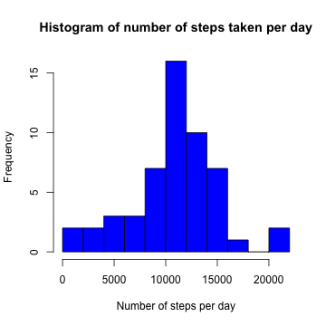
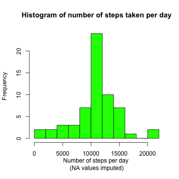
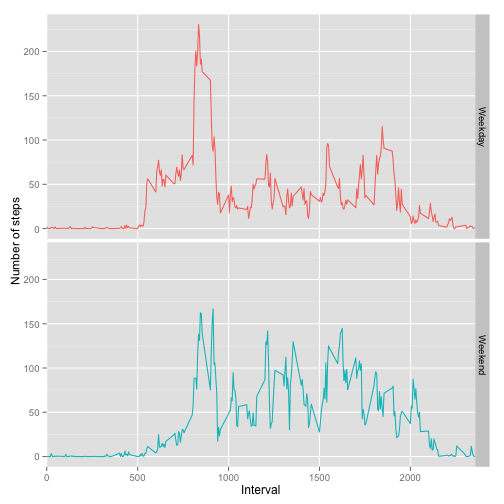

# Reproducible Research: Peer Assessment 1


## Loading and preprocessing the data

Read the raw data:

```r
dat <- read.csv(unzip(zipfile="activity.zip"))
```

## What is mean total number of steps taken per day?

First, the data was reshaped to calculate the total number of steps taken per day:

```r
library(reshape2)
dateMelt <- melt(dat[ ,1:2], id=c("date"))
steps <- dcast(dateMelt, date ~ variable, sum)
```

Histogram of the total number of steps taken per day:

```r
hist(steps$steps, xlab="Number of steps per day",
     main="Histogram of number of steps taken per day",
     col="blue", breaks=10)
```

 

Mean number of steps per day:

```r
mean(steps$steps, na.rm=TRUE)
```

```
## [1] 10766
```
Median number of steps per day:

```r
median(steps$steps, na.rm=TRUE)
```

```
## [1] 10765
```


## What is the average daily activity pattern?

First, the data was melted on the "interval" variable and cast to calculate statistics for each interval. 

```r
intervalMelt <- melt(dat, id=c("interval", "date"))
intervalMean <- dcast(intervalMelt, interval ~ variable, mean, na.rm=TRUE)
```

Time series plot of the 5-minute interval (x-axis) and the average number of steps taken, averaged across all days (y-axis):

```r
plot(intervalMean$interval, intervalMean$steps, type="l", xlab="Time interval", ylab="Mean number of steps", col="red")
```

 

Which 5-minute interval, on average across all the days in the dataset, contains the maximum number of steps?

```r
intervalMean[which.max(intervalMean$steps), ]
```

```
##     interval steps
## 104      835 206.2
```

## Imputing missing values

The total number of missing values in the dataset (i.e. the total number of rows with NAs):

```r
sum(is.na(x=dat))
```

```
## [1] 2304
```

Missing values were imputed by taking the mean for the 5-minute interval over all days using the `impute.mean()` function from the HotDeckImputation package:


```r
library(HotDeckImputation)
melted <- melt(dat, id=c("date", "interval"))
DI <- acast(melted, date ~ interval)
imputed.dat <- impute.mean(DI)
rownames(imputed.dat) <- rownames(DI); colnames(imputed.dat) <- colnames(DI)
```


Histogram of the total number of steps taken each day with missing values imputed:

```r
hist(apply(imputed.dat, MARGIN=1, FUN=sum), breaks=10, col="green", xlab="Number of steps per day \n(NA values imputed)", main="Histogram of number of steps taken per day")
```

 

Mean number of steps taken per day using data with imputed missing values:

```r
mean(apply(imputed.dat, MARGIN=1, FUN=sum))
```

```
## [1] 10766
```

Median number of steps taken per day using data with imputed missing values:

```r
median(apply(imputed.dat, MARGIN=1, FUN=sum))
```

```
## [1] 10766
```

The imputation has not shifted the absolute mean value, but has slightly increased the median number of steps per day. 

Reformat the data to summarise the data for weekdays and weekends, and get into format for ggplot:

```r
imputed.dat <- as.data.frame(imputed.dat)
days <- weekdays(as.POSIXlt(row.names(imputed.dat)), abbreviate=TRUE)
days <- ifelse(test=(days == "Sun" | days == "Sat"), yes="Weekend", no="Weekday")
imputed.dat <- cbind(days, imputed.dat)
plotMelt <- melt(imputed.dat, id.vars="days")
plotCast <- dcast(data=plotMelt, formula=days ~ variable, fun.aggregate=mean)
meanDat <- c(as.numeric(plotCast[1 ,-1]),  as.numeric(plotCast[2 ,-1]))
interval <- as.numeric(rep(colnames(plotCast[-1]), times=2))
var <- c(rep("Weekday", times=length(as.numeric(plotCast[1 ,-1]))),
         rep("Weekend", times=length(as.numeric(plotCast[2 ,-1]))))
plotDat <- data.frame(Day = as.factor(var), Interval = interval, MeanSteps = meanDat)
```

Plot showing the mean steps per interval for weekdays and weekends:

```r
library(ggplot2)
ggplot(data=plotDat, aes(x=Interval, y=MeanSteps, group=Day, colour=Day)) + 
        geom_line() +
        facet_grid(Day ~ .) +
        theme(legend.position="none") +
        scale_x_discrete(breaks=seq(from=0, to=2500, by=500))+
        scale_y_continuous(name="Number of steps")
```

 

When comparing activity patterns betwen weekdays and weekends using the dataaset with imputed missing values, there appears to be a higher level of activity between intervals 500 and 1000 on weekdays. However, on the weekends activity appears more variable, and higher, between intervals 1000 and 2000
